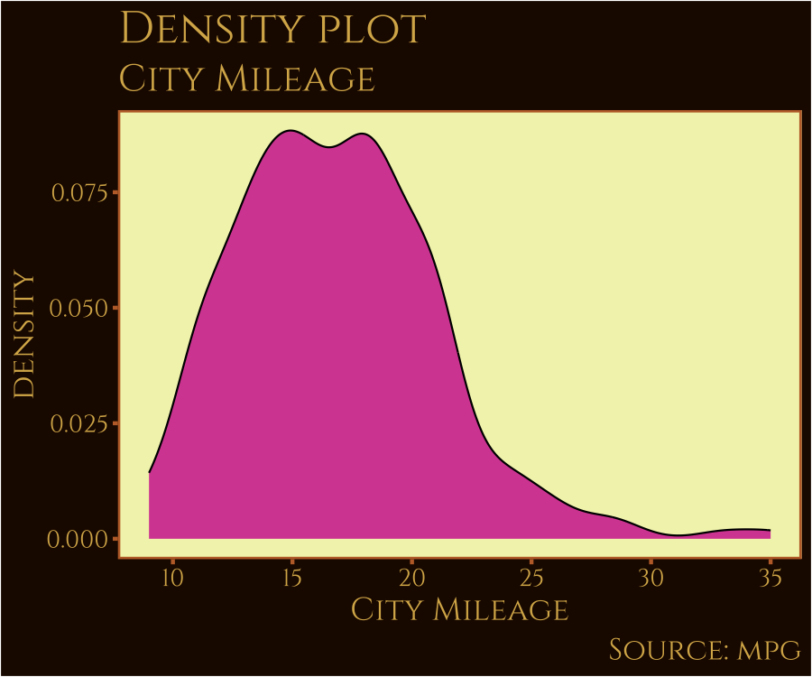
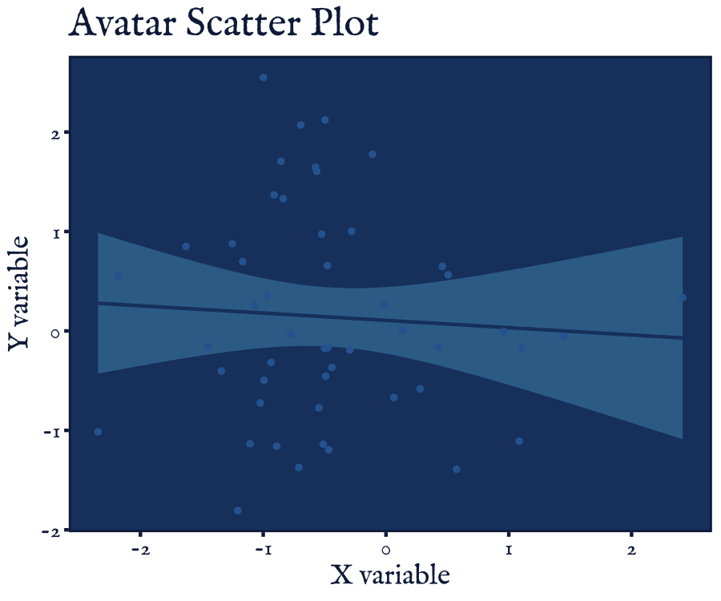

<!-- README.md is generated from README.Rmd. Please edit that file -->

<figure>

<figcaption aria-hidden="true">theme_park_banner</figcaption>
</figure>

# ThemePark

<!-- badges: start -->
<!-- badges: end -->

# Welcome to the Theme Park

Theme Park is a package for fun ggplot themes related to popular culture
(movies, TV shows, video-games, etc.). I don’t have much time to expand
this further so please consider submitting a theme!

## Submit a Theme

Please help grow this package by submitting your own custom ggplot theme
for a movie, show, or videogame. To submit, edit the
[`theme_template.R`](inst/theme_template.R) script file or run
`ThemePark:::new_theme_park_theme()` and send the edited script to
<matthew.jane@uconn.edu> or submit a pull request. I will review it and
add it or respond with suggested edits. Have fun with it!

## Themes contributed

| Name                  | Theme                    | Creator(s)                  |
|-----------------------|--------------------------|-----------------------------|
| **Barbie**            | `theme_barbie()`         | Matthew B. Jané             |
| **Oppenheimer**       | `theme_oppenheimer()`    | Matthew B. Jané & Toki Liam |
| **Star Wars**         | `theme_starwars()`       | Matthew B. Jané             |
| **Zelda**             | `theme_zelda()`          | Alex Slavenko               |
| **Terminator**        | `theme_terminator()`     | Alex Slavenko               |
| **Spiderman**         | `theme_spiderman()`      | Velu P.K. Immonen           |
| **Avatar**            | `theme_avatar()`         | Velu P.K. Immonen           |
| **Gryffindor**        | `theme_gryffindor()`     | Begum Ozemek                |
| **Hufflepuff**        | `theme_hufflepuff()`     | Begum Ozemek                |
| **Ravenclaw**         | `theme_ravenclaw()`      | Begum Ozemek                |
| **Slytherin**         | `theme_slytherin()`      | Begum Ozemek                |
| **Futurama**          | `theme_futurama()`       | Tylor J. Harlow             |
| **Simpsons**          | `theme_simpsons()`       | Tylor J. Harlow             |
| **Lord of the Rings** | `theme_lordoftherings()` | Ethan Milne                 |
| **Game of Thrones**   | `theme_gameofthrones()`  | Brennan Antone              |
| **Godfather**         | `theme_godfather()`      | Francisco Garre-Frutos      |
| **Finding Nemo**      | `theme_nemo()`           | Christopher T. Kenny        |
| **Friends**           | `theme_friends()`        | Alexis van STRAATEN         |
| **Alien**             | `theme_alien()`          | Luke Pilling                |

## Installation

You can install the development version of `ThemePark` from
[GitHub](https://github.com/) with:

``` r
# install.packages("remotes")
remotes::install_github("MatthewBJane/theme_park")
```

## Example

There are many theme options, listed above. You can see the list within
your R session using:

``` r
library(ThemePark)
head(themepark_themes)
#>         theme                     creator
#> 1      barbie             Matthew B. Jané
#> 2 oppenheimer Matthew B. Jané & Toki Liam
#> 3    starwars             Matthew B. Jané
#> 4       zelda               Alex Slavenko
#> 5  terminator               Alex Slavenko
#> 6   spiderman           Velu P.K. Immonen
```

Below is an example of using the Game of Thrones theme.

``` r
library(ggplot2)

`X variable` <- rnorm(50, 0, 1)
`Y variable` <- rnorm(50, 0, 1)

# see suggested colours in the palette
gameofthrones_theme_colors
#> background       text      panel     border    lighter      light     medium 
#>  "#1f0700"  "#D7B257"  "#F2F3B8"  "#BD6D33"  "#F2F3B8"  "#DFCB69"  "#BD6D33" 
#>       dark 
#>  "#8C4522"

ggplot(data = NULL, aes(x = `X variable`, y = `Y variable`)) +
  theme_gameofthrones(gameofthrones_font = TRUE) +
  geom_smooth(method = "lm",
              color = gameofthrones_theme_colors["dark"],
              fill = gameofthrones_theme_colors["light"]) +
  geom_point(color = gameofthrones_theme_colors["medium"]) +
  ggtitle("Game of Thrones Scatter Plot")
#> `geom_smooth()` using formula = 'y ~ x'
```


We can mix this with colors from the Barbie theme.

``` r
g <- ggplot(mpg, aes(cty))
g + geom_density(aes(fill = factor(cyl)), alpha = 0.8) +
  labs(
    title = "Density plot",
    subtitle = "City Mileage Grouped by Number of cylinders",
    caption = "Source: mpg",
    x = "City Mileage",
    fill = "# Cylinders"
  ) +
  theme_gameofthrones() +
  scale_color_barbie()
```



``` r
ggplot(data = NULL, aes(x = `X variable`, y = `Y variable`)) +
  theme_avatar(avatar_font = TRUE) +
  geom_smooth(method = "lm", color = avatar_theme_colors["dark"], fill = avatar_theme_colors["light"]) +
  geom_point(color = avatar_theme_colors["medium"]) +
  ggtitle("Avatar Scatter Plot")
#> `geom_smooth()` using formula = 'y ~ x'
```


``` r
ggplot(data.frame(x = rnorm(100), y = rnorm(100)), aes(x, y)) +
  geom_smooth(method = "lm", color = godfather_theme_colors["dark"], fill = godfather_theme_colors["light"]) +
  geom_point(color = godfather_theme_colors["medium"]) +
  labs(title = "The Godfather theme", x = "Variable x", y = "Variable y") +
  theme_godfather(godfather_font = TRUE)
#> `geom_smooth()` using formula = 'y ~ x'
```



## Citation

### BibTeX:

    @software{JaneBarbie2023,
      author = {Jané, Matthew B},
      month = {6},
      title = {theme_park: popular culture ggplot themes},
      url = {https://github.com/MatthewBJane/theme_park},
      version = {1.0.0},
      year = {2023}
    }

### APA:

Jané, M.B. (2023). theme_park: popular culture ggplot themes (Version
0.0.1) \[Source Code\]. <https://github.com/MatthewBJane/theme_park>
