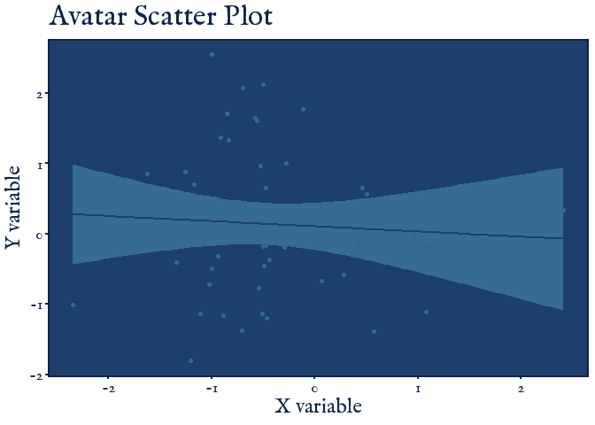

<!-- README.md is generated from README.Rmd. Please edit that file -->

<figure>

<figcaption aria-hidden="true">theme_park_banner</figcaption>
</figure>

# ThemePark

<!-- badges: start -->
<!-- badges: end -->

# Welcome to the Theme Park

Theme Park is a soon to be package for fun ggplot themes related to
popular culture (movies, TV shows, video-games, etc.). I don”t have much
time to expand this further so please consider submitting a theme!

## Submit a Theme

Please help grow this package by submitting your own custom ggplot theme
for a movie, show, or videogame. To submit, edit the
[`R/theme_template.R`](R/theme_template.R) script file and send the
edited script to <matthew.jane@uconn.edu> or submit a pull request. I
will review it and add it or respond with suggested edits. Have fun with
it!

## Themes contributed

| Name                  | Theme                  | Creator(s)                  | Source                                                                                                          |
|-----------------------|------------------------|-----------------------------|-----------------------------------------------------------------------------------------------------------------|
| **Barbie**            | `theme_barbie`         | Matthew B. Jané             | [theme_barbie.R](https://raw.githubusercontent.com/MatthewBJane/theme_park/main/theme_barbie.R)                 |
| **Oppenheimer**       | `theme_oppenheimer`    | Matthew B. Jané & Toki Liam | [theme_oppenheimer.R](https://raw.githubusercontent.com/MatthewBJane/theme_park/main/theme_oppenheimer.R)       |
| **Star Wars**         | `theme_starwars`       | Matthew B. Jané             | [theme_starwars.R](https://raw.githubusercontent.com/MatthewBJane/theme_park/main/theme_starwars.R)             |
| **Zelda**             | `theme_zelda`          | Alex Slavenko               | [theme_zelda.R](https://raw.githubusercontent.com/MatthewBJane/theme_park/main/theme_zelda.R)                   |
| **Terminator**        | `theme_terminator`     | Alex Slavenko               | [theme_terminator.R](https://raw.githubusercontent.com/MatthewBJane/theme_park/main/theme_terminator.R)         |
| **Spiderman**         | `theme_spiderman`      | Velu P.K. Immonen           | [theme_spiderman.R](https://raw.githubusercontent.com/MatthewBJane/theme_park/main/theme_spiderman.R)           |
| **Avatar**            | `theme_avatar`         | Velu P.K. Immonen           | [theme_avatar.R](https://raw.githubusercontent.com/MatthewBJane/theme_park/main/theme_avatar.R)                 |
| **Gryffindor**        | `theme_gryffindor`     | Begum Ozemek                | [theme_hogwarts.R](https://raw.githubusercontent.com/MatthewBJane/theme_park/main/theme_hogwarts.R)             |
| **Hufflepuff**        | `theme_hufflepuff`     | Begum Ozemek                | [theme_hogwarts.R](https://raw.githubusercontent.com/MatthewBJane/theme_park/main/theme_hogwarts.R)             |
| **Ravenclaw**         | `theme_ravenclaw`      | Begum Ozemek                | [theme_hogwarts.R](https://raw.githubusercontent.com/MatthewBJane/theme_park/main/theme_hogwarts.R)             |
| **Slytherin**         | `theme_slytherin`      | Begum Ozemek                | [theme_hogwarts.R](https://raw.githubusercontent.com/MatthewBJane/theme_park/main/theme_hogwarts.R)             |
| **Futurama**          | `theme_futurama`       | Tylor J. Harlow             | [theme_futurama.R](https://raw.githubusercontent.com/MatthewBJane/theme_park/main/theme_futurama.R)             |
| **Simpsons**          | `theme_simpsons`       | Tylor J. Harlow             | [theme_simpsons.R](https://raw.githubusercontent.com/MatthewBJane/theme_park/main/theme_simpsons.R)             |
| **Lord of the Rings** | `theme_lordoftherings` | Ethan Milne                 | [theme_lordoftherings.R](https://raw.githubusercontent.com/MatthewBJane/theme_park/main/theme_lordoftherings.R) |
| **Game of Thrones**   | `theme_gameofthrones`  | Brennan Antone              | [theme_gameofthrones.R](https://raw.githubusercontent.com/MatthewBJane/theme_park/main/theme_gameofthrones.R)   |
| **Godfather**         | `theme_godfather`      | Francisco Garre-Frutos      | [theme_godfather.R](https://raw.githubusercontent.com/MatthewBJane/theme_park/main/theme_godfather.R)           |
| **Finding Nemo**      | `theme_nemo`           | Christopher T. Kenny        | [theme_nemo.R](https://raw.githubusercontent.com/MatthewBJane/theme_park/main/theme_nemo.R)                     |

## Installation

You can install the development version of `ThemePark` from
[GitHub](https://github.com/) with:

``` r
# install.packages("remotes")
remotes::install_github("MatthewBJane/theme_park")
```

## Example

There are many theme options, listed above.

Below is an example of using the Game of Thrones theme.

``` r
library(ThemePark)
library(ggplot2)

`X variable` <- rnorm(50, 0, 1)
`Y variable` <- rnorm(50, 0, 1)

ggplot(data = NULL, aes(x = `X variable`, y = `Y variable`)) +
  theme_gameofthrones(gameofthrones_font = TRUE) +
  geom_smooth(method = "lm", color = "#8C4522", fill = "#DFCB69") +
  geom_point(color = "#BD6D33") +
  ggtitle("Game of Thrones Scatter Plot")
#> `geom_smooth()` using formula = 'y ~ x'
```


We can mix this with colors from the Barbie theme.

``` r
g <- ggplot(mpg, aes(cty))
g + geom_density(aes(fill = factor(cyl)), alpha = 0.8) +
  labs(
    title = "Density plot",
    subtitle = "City Mileage Grouped by Number of cylinders",
    caption = "Source: mpg",
    x = "City Mileage",
    fill = "# Cylinders"
  ) +
  theme_gameofthrones() +
  scale_color_barbie()
```


``` r
ggplot(data = NULL, aes(x = `X variable`, y = `Y variable`)) +
  theme_avatar(avatar_font = TRUE) +
  geom_smooth(method = "lm", color = "#1C3F6E", fill = "#5AACCF") +
  geom_point(color = "#2E67A0") +
  ggtitle("Game of Thrones Scatter Plot")
#> `geom_smooth()` using formula = 'y ~ x'
```



``` r
ggplot(data.frame(x = rnorm(100), y = rnorm(100)), aes(x, y)) +
  geom_smooth(method = "lm", color = "#912411", fill = "#912411") +
  geom_point(color = "#d3cfc3") +
  labs(title = "The Godfather theme", x = "Variable x", y = "Variable y") +
  theme_godfather(godfather_font = T)
#> `geom_smooth()` using formula = 'y ~ x'
```


## Citation

### BibTeX:

    @software{JaneBarbie2023,
      author = {Jané, Matthew B},
      month = {6},
      title = {theme_park: popular culture ggplot themes},
      url = {https://github.com/MatthewBJane/theme_park},
      version = {1.0.0},
      year = {2023}
    }

### APA:

Jané, M.B. (2023). theme_park: popular culture ggplot themes (Version
0.0.1) \[Source Code\]. <https://github.com/MatthewBJane/theme_park>
